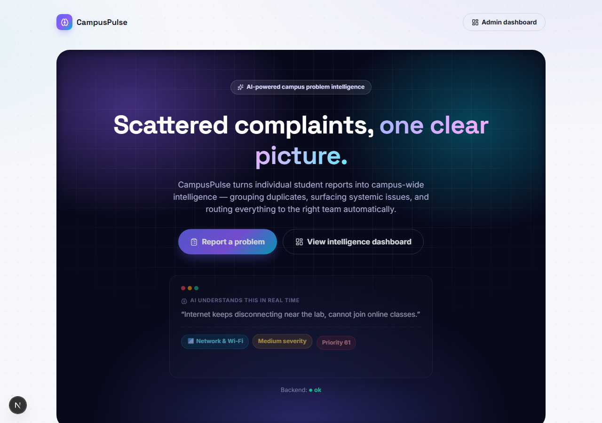
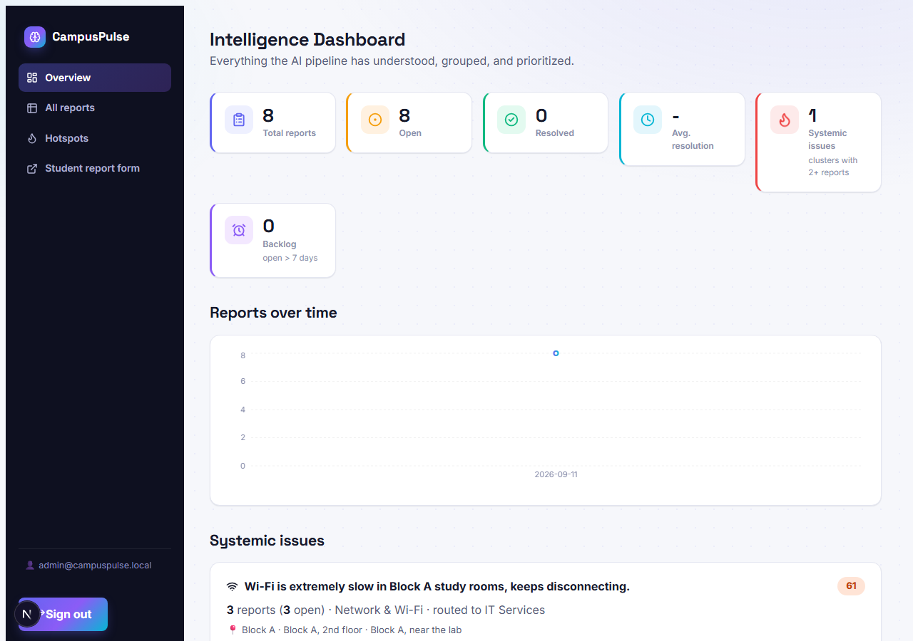
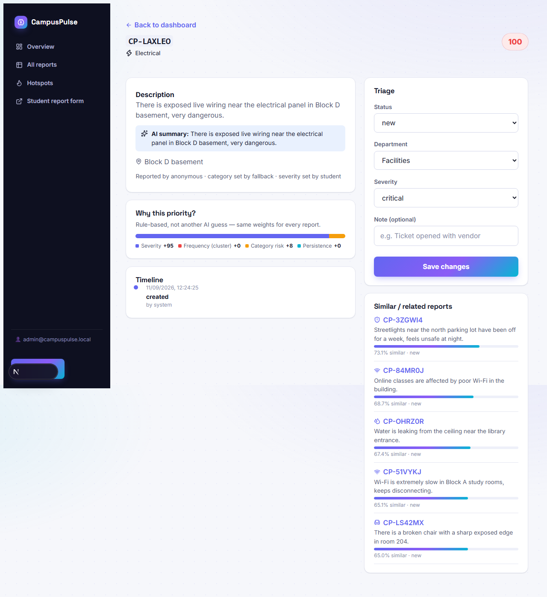

# CampusPulse

AI-powered campus problem intelligence platform.

**Loop:** Student Report → Understand → Group → Prioritize → Route → Resolve → Learn

Built for Campusathon 2026 (Team Gradient Descenters, PS5 — Campus Problem Intelligence).

<p align="center">
  
  
  
</p>

## What it does

A student reports a campus problem (description, location, optional category/severity/photo).
CampusPulse then:

1. **Understands** it — an LLM (Claude) classifies the issue, infers whatever the student left
   blank, and writes a normalized one-line summary. No API key? It falls back to a deterministic
   keyword classifier so the app is never dead in the water.
2. **Groups** it — a local, offline embedding model (no API key needed) finds semantically similar
   existing reports, even when the wording is completely different ("Wi-Fi is slow in Block A" /
   "internet keeps disconnecting near the lab" / "online classes are affected by poor Wi-Fi" all
   land in the same cluster). Near-identical reports are linked as duplicates.
3. **Prioritizes** it — a transparent, rule-based score combining severity, how many
   reports are in the cluster (frequency/affected users), category risk, and persistence
   (how long it's been recurring). Every report in a cluster gets rescored as it grows, so a
   systemic issue visibly gets more urgent.
4. **Routes** it — to one of a fixed set of departments, via a closed category→department mapping
   (never an invented, unroutable department).
5. Gives admins an **intelligence dashboard**: stats, systemic-issue hotspots, a trends chart, a
   priority-sorted queue with filters, and a per-report detail view with the similar-reports panel
   and triage controls.
6. Lets students **track** their report's status and timeline with just their tracking code — no
   account needed.

## Stack

| Layer     | Tech                                                          |
|-----------|----------------------------------------------------------------|
| Frontend  | Next.js (App Router) + TypeScript                              |
| Backend   | FastAPI + SQLAlchemy                                            |
| Database  | PostgreSQL + `pgvector`                                         |
| AI        | Claude (classification, via Anthropic API) + local embeddings (`fastembed`, offline, no key) |
| Auth      | JWT (one admin role; students use tracking codes, no accounts) |

## Project structure

```
CampusPulse/
├── backend/
│   ├── app/
│   │   ├── main.py            # app entrypoint, CORS, error handlers, routers, static /uploads
│   │   ├── config.py          # env-based settings
│   │   ├── ai/
│   │   │   ├── taxonomy.py    # fixed category/department taxonomy + keyword fallback rules
│   │   │   ├── classify.py    # Claude classification, with keyword-fallback on any failure
│   │   │   ├── embeddings.py  # local offline embeddings (fastembed)
│   │   │   ├── similarity.py  # pgvector similarity search + duplicate/cluster assignment
│   │   │   ├── priority.py    # rule-based dynamic priority scoring
│   │   │   └── pipeline.py    # orchestrates classify -> embed -> cluster
│   │   ├── db/                # SQLAlchemy models, session, dev init/seed
│   │   ├── routers/           # health, auth, reports, departments, stats
│   │   ├── schemas/           # Pydantic request/response models
│   │   ├── services/          # report_service (the Prioritize/Route/Resolve/Learn logic),
│   │   │                      # uploads, tracking codes
│   │   └── core/              # errors, security (JWT/hashing), auth dependency
│   ├── requirements.txt
│   └── .env.example
├── frontend/
│   ├── app/
│   │   ├── page.tsx                 # landing page: pipeline/feature sections + report form
│   │   ├── icon.svg                 # favicon (Next.js file-based metadata convention)
│   │   ├── not-found.tsx / error.tsx  # branded 404 / crash screens
│   │   ├── track/[code]/             # student tracking page (status stepper + timeline)
│   │   └── admin/
│   │       ├── layout.tsx            # wraps admin routes in AdminAuthProvider
│   │       ├── page.tsx              # intelligence dashboard (KPIs, trend chart, hotspots, queue)
│   │       └── reports/[id]/         # report detail: "why this priority" + similar-reports panel
│   ├── components/                   # Sidebar, KpiCard, PriorityBar, AIDemo, Reveal,
│   │                                  # AnimatedNumber, LoginForm
│   ├── lib/                          # api.ts (typed client), AdminAuthContext.tsx, display.tsx
│   └── .env.local.example
├── docker-compose.yml   # Postgres with the pgvector extension
└── README.md
```

## Running locally

### 1. Database

```bash
docker compose up -d
```

Starts Postgres (pgvector-enabled) on `localhost:5432`, user/password/db all `campuspulse`.

### 2. Backend

```bash
cd backend
python -m venv .venv          # use Python 3.12 -- 3.14 has no psycopg2-binary wheel yet
.venv\Scripts\activate
pip install -r requirements.txt
copy .env.example .env
uvicorn app.main:app --reload
```

The first report submission after a fresh install downloads the local embedding model
(~130MB, one-time, cached afterwards) — that request will take longer than the rest.

On startup the API creates tables, enables the `pgvector` extension, seeds departments, and
seeds one admin account (`ADMIN_EMAIL`/`ADMIN_PASSWORD` in `.env`, defaults to
`admin@campuspulse.local` / `changeme123`) — all best-effort, so `/health` still works even if
Postgres isn't up yet.

**Optional but recommended:** set `ANTHROPIC_API_KEY` in `backend/.env` to enable real LLM
classification. Without it, category/severity/summary come from a deterministic keyword
classifier — the app is fully functional either way; duplicate/similarity detection always works
offline regardless (it doesn't use Claude).

Check it:
- `GET /health` → `{"status": "ok", ...}` (no DB dependency)
- `GET /health/db` → DB connectivity
- Interactive docs: `http://localhost:8000/docs`

### 3. Frontend

```bash
cd frontend
npm install
copy .env.local.example .env.local
npm run dev
```

Open `http://localhost:3000`. Submit a report on the home page, then visit `/admin` and log in
with the seed admin credentials to see the dashboard.

**Try the demo scenario from the pitch:** submit three worded-differently Wi-Fi complaints (e.g.
"Wi-Fi is extremely slow in Block A", "internet keeps disconnecting near the lab", "online classes
are affected by poor Wi-Fi") — they'll cluster into one systemic issue on the dashboard even
though they share almost no keywords, and the cluster's priority climbs with each new report.

## API reference

| Method | Path                     | Auth  | Description                                          |
|--------|--------------------------|-------|--------------------------------------------------------|
| GET    | `/health`                | none  | Liveness check, no DB dependency                        |
| GET    | `/health/db`             | none  | DB connectivity check                                   |
| POST   | `/auth/login`            | none  | Admin login → JWT                                       |
| GET    | `/auth/me`               | admin | Current admin info                                      |
| POST   | `/reports`               | none  | Submit a report (multipart: description, location, optional category/severity/reporter_email/image) |
| GET    | `/reports/track/{code}`  | none  | Public lookup by tracking code (student use)            |
| GET    | `/reports/categories`    | none  | The fixed category taxonomy (for the report form)       |
| GET    | `/reports`               | admin | List/filter reports (status, department, category, cluster_id), sorted by priority |
| GET    | `/reports/{id}`          | admin | Full report detail incl. timeline                       |
| GET    | `/reports/{id}/similar`  | admin | Top-k semantically similar reports with similarity score|
| PATCH  | `/reports/{id}`          | admin | Update status/department/severity; logs a timeline event and recomputes cluster priority |
| GET    | `/departments`           | none  | Seeded departments                                      |
| GET    | `/stats/overview`        | admin | Totals, resolution time, backlog, breakdowns             |
| GET    | `/stats/hotspots`        | admin | Systemic issues: clusters with 2+ reports, ranked by priority |
| GET    | `/stats/trends`          | admin | Reports-per-day for the last N days                      |

## Design notes worth knowing

- **Priority is rule-based, not another LLM call.** Explainable, deterministic, and cheap to
  recompute for a whole cluster every time a new report joins it. The LLM's job is understanding
  language; ranking is arithmetic (`app/ai/priority.py`).
- **Similarity/duplicate detection never needs an API key.** It uses `fastembed` (ONNX, no torch)
  running fully locally — this is what keeps the "different words, same issue" demo scenario
  reliable even offline.
- **Classification degrades gracefully.** No `ANTHROPIC_API_KEY`, a network blip, or a rate limit
  all fall back to keyword rules rather than failing the report submission.
- **Category/department is a closed taxonomy** (`app/ai/taxonomy.py`), not open text the LLM can
  invent — this is what keeps grouping and routing reliable.
- **No Alembic yet** — schema is created via `Base.metadata.create_all` at startup. Fine while the
  schema is still moving; if you change `db/models.py` on a machine with existing data, run
  `docker compose down -v && docker compose up -d` to reset the dev database rather than trying to
  hand-patch columns.
- **Cross-category clustering has a stricter bar.** Two reports in the *same* category sharing
  vocabulary ("slow", "disconnecting") are very likely the same recurring issue (threshold 0.72).
  Two reports in *different* categories merely sharing tone ("dangerous", "unsafe") are not — an
  exposed live wire and a dead streetlight are both safety concerns in the abstract, but grouping
  them as one systemic issue would undermine the one thing this feature needs to be trustworthy
  about, so cross-category clustering requires 0.88 (`app/ai/similarity.py`).
- **Priority is explainable, not just a number.** The report detail page's "Why this priority?"
  panel breaks the score into its four weighted terms (severity, cluster frequency, category risk,
  persistence) — `priority_breakdown` is stored per-report specifically so the UI never has to
  re-derive or guess at the reasoning.

## Demo script (for judges)

A ~90-second walkthrough that hits every claim in the pitch:

1. **Submit 3 differently-worded Wi-Fi reports** on the home page (leave category/severity blank
   each time): "Wi-Fi is extremely slow in Block A", "internet keeps disconnecting near the lab",
   "online classes are affected by poor Wi-Fi in the building". Point out the AI-demo card in the
   hero already showing this live — it's not staged, it's the same classifier.
2. **Open `/admin`**, log in, and point at the **Systemic issues** section: all three reports
   merged into one cluster despite sharing almost no keywords, and its priority is higher than any
   single report's would be — that's the "50 tickets vs. 1 problem" pitch, live.
3. **Submit a 4th report reusing near-identical wording** ("Wi-Fi is extremely slow in Block A and
   keeps disconnecting") — refresh the dashboard and show it linked as a **duplicate**, not just
   another cluster member.
4. **Click into the critical electrical-hazard seed report** (or submit one: "exposed live wiring
   near the electrical panel") and show the **"Why this priority?"** breakdown bar — judges can see
   the exact arithmetic, not a black-box score.
5. **Resolve a report** from the detail page and jump back to Overview — avg. resolution time and
   the resolved count update immediately.

## What's deliberately out of scope

- Notifications (email/SMS) on status change
- Vision-model analysis of uploaded photos (stored/displayed only)
- Student accounts (tracking-code based lookup is the whole "auth" story for students)
- Multi-tenant/multi-campus support
- Production migration tooling (see the Alembic note above)
